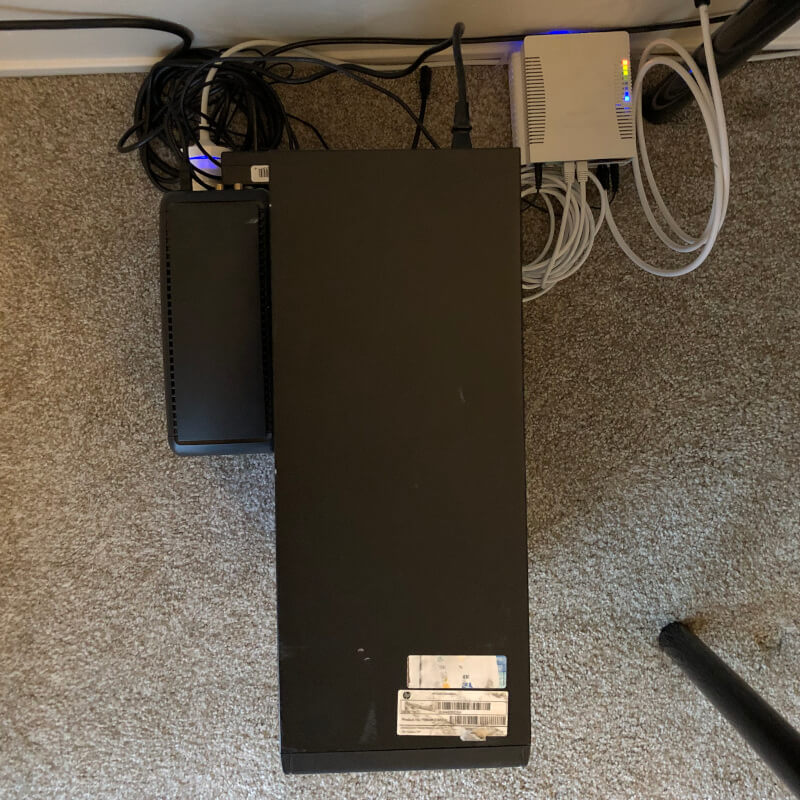

# Deep learning setup and sysadmin homelab

Below you will find our deep learning's setup! The whole computer was built by [my fiancé](https://github.com/Avatat). Thanks, Honey! 

### Let's try something new, let's try AMD ROCm!

Our first idea was to choose AMD GPU and use ROCm stack. We chose AMD because it's much cheaper than Nvidia hardware, and ROCm was a totally new thing for us. But it was not the best decision - read on, to get to know why...

The first setup was built on:
- HP Z420 with 600 W PSU (\$350)
- E5-1650 v2 (v2 is the oldest/cheapest CPU family with PCIe Atomics support)
- 32 GB RAM @ 1600 MHz
- RX 480 8 GB, blower-style cooling (\$130)
- ADATA SU800 512 GB (\$76)

Above setup consume 80 W when idle, 220 W when computing on GPU, and 280 W on full GPU and CPU load.

Software:
- Ubuntu 18.10
- Kernel 4.19
- ROCm 1.9.2
- Tensorflow-rocm 1.12.0

We can't use anything other than Tensorflow, because only this framework works on ROCm. We used the newest Ubuntu 18.10 to have fresh packages, and 4.19 Kernel, because it has built-in ROCm drivers. 4.18 has a built-in driver too, but there were huge problems with GPU power management.
We had a lot of problems with ROCm - [it was crashing after reloading driver (after shutting down Windows-based gaming VM)](https://github.com/RadeonOpenCompute/ROCm_Documentation/issues/15), it [stopped working after upgrading to 2.0](https://github.com/ROCmSoftwarePlatform/tensorflow-upstream/issues/142), we [can't run compiled Tensorflow-rocm](https://github.com/ROCmSoftwarePlatform/tensorflow-upstream/issues/273) (to add AVX/SSE4 support), and [documentation isn't best](https://github.com/RadeonOpenCompute/ROCm_Documentation/issues/27).

### ROCm isn't best - let's switch to a proven solution!

We decided to buy a second GPU, but this time from Nvidia. After a short search, we decided for used GTX1070, because it's the cheapest Nvidia's GPU with 8 GB of memory and pretty good computing power. Our HP Z420 doesn't have second PCIe power plug, so we had to buy an adapter from 2x SATA to 1x 8pin PCIe (important: adapter had been connected to two different SATA power cables). We also had luck because we found used CyberPower UPS (with battery) for 20 bucks only! A fast and simple test shown, that UPS will work for 3 minutes under full load.

After 10 days of waiting (GPU #2 had a long trip from the East Coast to the West Coast), we assembled everything:

Added hardware:
- Nvidia GTX 1070 (\$249)
- SATA -> 8pin power adapter (\$6)
- Toshiba N300 4 TB (\$130)
- CyberPower 1000 VA UPS (\$20)

The above setup consumes 105 W when idle and 375 W when both GPUs and CPU are fully loaded.

Changed software:
- Ubuntu 18.04 LTS
- Default Kernel (4.15)
- CUDA 9.0, cuDNN 7.4
- Tensorflow 1.12

### Summary

What did we gained after adding Nvidia GPU?
1. Daria can work with other frameworks (she like PyTorch).
2. CUDA stack is rock-solid.
3. We noticed 2x faster computing - compared on a simple CNN, VGG, and Hashcat.
4. Host stopped crashing after shutting down gaming VM (because AMD drivers had been disabled).
5. Models can be trained on GTX while we play on gaming VM with RX.
6. We can still try ROCm things.

All of the above cost $961, and we have all that we dreamed of: powerful CPU with 12 threads, a lot of memory (32 GB), two powerful GPUs, fast storage (SU800), large (4 TB) storage for backups and archives. It's a complete homelab where we can do a lot of self-learning :)

### Future plans

1. Upgrade software to Ubuntu 18.10, CUDA 10
2. Add second, cheaper workstation with one, cheaper Nvidia GPU
3. Add InfiniBand network
